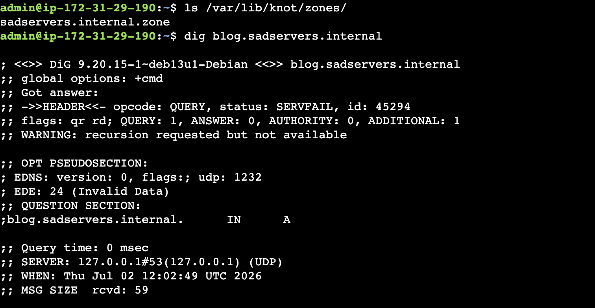
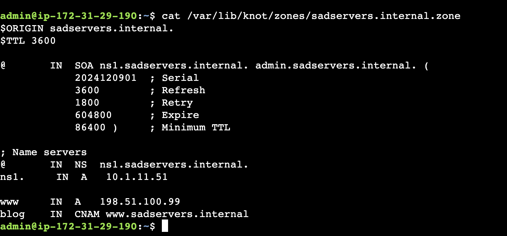
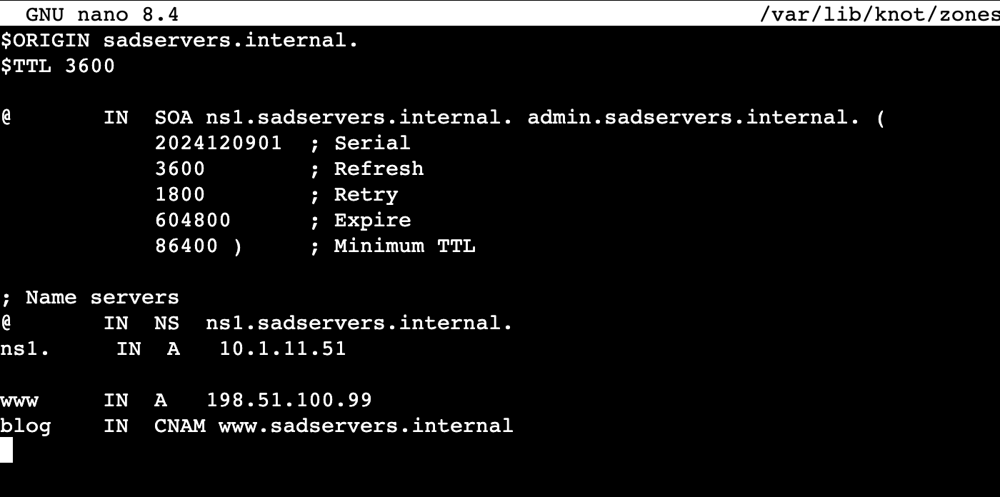
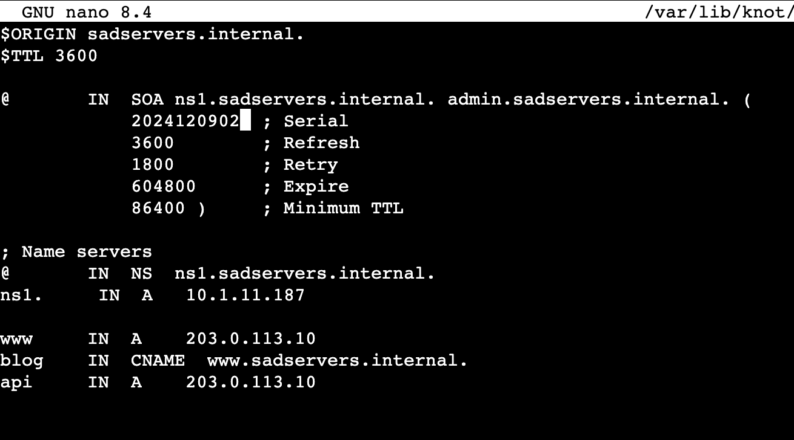
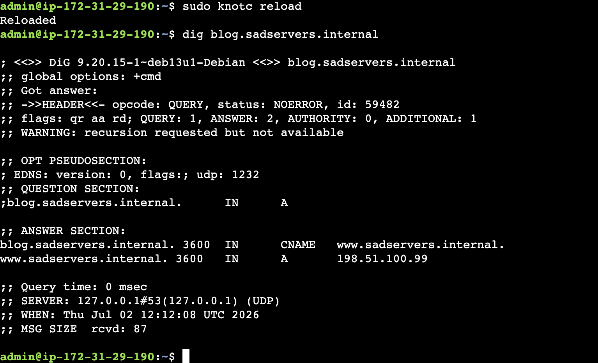
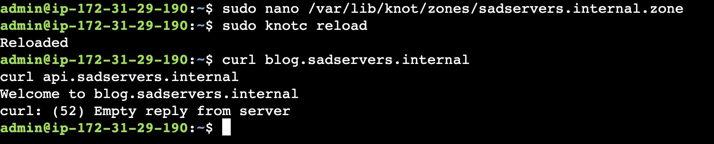

# DNS Troubleshooting Lab: SadServers "Tied in a Knot"

## Scenario Goal

The objective of this lab was to diagnose and fix a broken DNS server running Knot DNS that was preventing internal users from resolving and accessing `blog.sadservers.internal` and `api.sadservers.internal`.

---

## Step 1: Investigation & Diagnosis

### Checking DNS Status

To identify why the domain wasn't resolving, I queried the local DNS server using:

```bash
dig blog.sadservers.internal
```



**Finding**

The server returned a `SERVFAIL` status along with an Extended DNS Error (`EDE: 24 (Invalid Data)`). This indicated that while the Knot DNS service was running, the zone database contained syntax errors that prevented it from loading successfully.

### Inspecting the Zone File

I located the active zone files in `/var/lib/knot/zones/` and inspected the DNS database.

```bash
cat /var/lib/knot/zones/sadservers.internal.zone
```



---

## Step 2: Identifying the Root Causes

After reviewing the zone file, I identified three configuration issues responsible for the failure.

### 1. Misspelled Record Type

The `blog` record was configured as `CNAM` instead of the correct `CNAME`.

### 2. Missing Trailing Dot

The alias target `www.sadservers.internal` was missing the trailing period (`.`), causing Knot DNS to interpret it as a relative name instead of a Fully Qualified Domain Name (FQDN).

### 3. Incorrect Service Records

- The `www` A record pointed to an incorrect placeholder IP (`198.51.100.99`).
- The `api` A record was missing entirely.

---

## Step 3: Resolution & Implementation

### Fixing the Zone File

Using `nano`, I corrected the DNS syntax by:

- Changing `CNAM` to `CNAME`
- Adding the missing trailing dot to the CNAME target

At this stage, the `www` record was still pointing to the old IP address.



### Discovering the Correct Backend IP Addresses

To determine where the services were actually running, I inspected the server's network interfaces.

```bash
ip address
```


**Discovery**

The backend services were running inside Docker containers using:

- **203.0.113.10** → Web / Blog service
- **203.0.113.20** → API service

### Updating the DNS Database

After correcting the records, I committed the changes using Knot DNS's transaction mechanism and incremented the SOA serial number to ensure the updated zone would be propagated correctly.



---

## Step 4: Verification

After reloading the DNS service:

```bash
sudo knotc reload
```

### DNS Validation

A new `dig` query returned a successful `NOERROR` response, confirming that the CNAME and A records resolved correctly.



### Application Validation

Finally, I verified application connectivity using `curl`, confirming that the blog service was reachable and the DNS configuration was functioning correctly.



---

# Key Takeaways

- Even a small DNS syntax error (such as a missing trailing dot) can prevent an entire zone from loading.
- Knot DNS uses transactional updates, making proper commits and serial number management essential after modifying zone files.
- Troubleshooting is most effective when performed layer by layer, starting from DNS resolution, then network connectivity, and finally application accessibility.